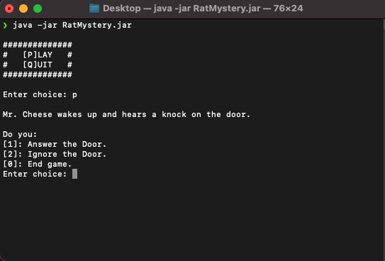

<a name="readme-top"></a>

<div align="center">
<h3 align="center">Rat Murder Mystery</h3>
    <svg xmlns="http://www.w3.org/2000/svg" xmlns:xlink="http://www.w3.org/1999/xlink" width="100" height="100" viewBox="0 0 2834.88 2834.88">
    <path fill-rule="evenodd" fill="#FFF" fill-opacity="1" d="M 1138.28125 1949.605469 C 1047.410156 1857.84375 914.152344 1724.589844 863.324219 1627.359375 C 835.824219 1574.75 863.675781 1548.761719 869.164062 1469.398438 C 876.613281 1361.738281 848.410156 1339.488281 857.691406 1275.121094 C 866.011719 1217.421875 910.21875 1088.199219 933.304688 1042.03125 C 956.390625 995.859375 1002.558594 910.738281 1002.558594 910.738281 C 1002.558594 910.738281 963.601562 831.390625 895.792969 763.578125 C 827.980469 695.769531 709.5625 705.691406 656.289062 779.449219 C 581.265625 883.328125 615.980469 1023.230469 653.496094 1112.691406 C 691.007812 1202.140625 807.871094 1265.621094 807.871094 1265.621094 C 807.871094 1265.621094 728.519531 1238.210938 672.25 1194.921875 C 615.980469 1151.640625 589.347656 1112.730469 564.097656 1002.71875 C 538.851562 892.710938 546.0625 714.519531 735.429688 660.421875 C 924.792969 606.308594 1056.648438 855.289062 1056.648438 855.289062 C 1056.648438 855.289062 1171.109375 772.011719 1411.308594 764.109375 C 1640.71875 756.570312 1777.988281 855.289062 1777.988281 855.289062 C 1777.988281 855.289062 1909.851562 606.308594 2099.21875 660.421875 C 2288.578125 714.519531 2295.800781 892.710938 2270.550781 1002.71875 C 2245.300781 1112.730469 2218.660156 1151.640625 2162.390625 1194.921875 C 2106.128906 1238.210938 2026.769531 1265.621094 2026.769531 1265.621094 C 2026.769531 1265.621094 2142.199219 1206.46875 2179.710938 1117.011719 C 2217.21875 1027.558594 2253.378906 883.328125 2178.359375 779.449219 C 2125.078125 705.691406 2006.671875 695.769531 1938.851562 763.578125 C 1871.039062 831.390625 1832.089844 910.738281 1832.089844 910.738281 C 1832.089844 910.738281 1878.261719 995.859375 1901.339844 1042.03125 C 1924.429688 1088.199219 1968.640625 1217.421875 1976.960938 1275.121094 C 1986.238281 1339.488281 1958.03125 1361.738281 1965.480469 1469.398438 C 1970.96875 1548.761719 1998.820312 1574.75 1971.320312 1627.359375 C 1920.488281 1724.589844 1787.238281 1857.84375 1696.359375 1949.605469 L 1866.878906 1952.519531 L 1670.191406 1977.449219 L 1848.410156 2044.859375 L 1654.5 2007 L 1778.230469 2117.804688 L 1616.640625 2032.855469 L 1616.789062 2032.484375 C 1569.46875 2083.535156 1544.050781 2109.558594 1544.050781 2109.558594 C 1544.050781 2109.558594 1533.109375 2095.152344 1508.140625 2087.023438 C 1478.210938 2077.273438 1434.398438 2079.550781 1434.398438 2079.550781 C 1434.398438 2079.550781 1482.050781 2084.554688 1509.558594 2101.691406 C 1528.550781 2113.53125 1533.371094 2123.5625 1533.371094 2123.5625 C 1533.371094 2123.5625 1508.078125 2182.222656 1417.078125 2182.207031 C 1335.089844 2182.191406 1301.269531 2123.5625 1301.269531 2123.5625 C 1301.269531 2123.5625 1306.089844 2113.53125 1325.089844 2101.691406 C 1352.589844 2084.554688 1400.25 2079.550781 1400.25 2079.550781 C 1400.25 2079.550781 1356.441406 2077.273438 1326.5 2087.023438 C 1301.53125 2095.152344 1290.601562 2109.558594 1290.601562 2109.558594 C 1290.601562 2109.558594 1265.179688 2083.535156 1217.859375 2032.484375 L 1218.011719 2032.855469 L 1056.421875 2117.804688 L 1180.148438 2007 L 986.238281 2044.859375 L 1164.449219 1977.449219 L 967.769531 1952.519531 Z M 1213.910156 1599.929688 C 1228.640625 1541.210938 1211.851562 1476.449219 1164.460938 1432.289062 C 1117.070312 1388.140625 1051.28125 1375.960938 993.746094 1394.800781 C 979.011719 1453.519531 995.808594 1518.289062 1043.199219 1562.441406 C 1090.589844 1606.589844 1156.378906 1618.78125 1213.910156 1599.929688 Z M 1620.738281 1599.929688 C 1678.269531 1618.78125 1744.058594 1606.589844 1791.449219 1562.441406 C 1838.828125 1518.289062 1855.628906 1453.519531 1840.898438 1394.800781 C 1783.371094 1375.960938 1717.578125 1388.140625 1670.191406 1432.289062 C 1622.800781 1476.449219 1606 1541.210938 1620.738281 1599.929688 "/>
</div>

<div align="center">
        <h4>Table of Contents</h4>
        <p><a href="#about-the-project">About The Project</a></p>
        <p><a href="#getting-started">Getting Started</a></p>
        <p><a href="#license">License</a></p>
        <p><a href="#contact">Contact</a></p>
        <p><a href="#acknowledgments">Acknowledgments</a></p> 
</div>

## About The Project

Join Mr. Cheese in his mysterious and perilous adventure through the terminal as
he searches for his missing wife. Navigate through a series of choices and encounters
in this "Choose Your Own Adventure" style text game, where every decision leads
Mr. Cheese closer to uncovering the truth. Will you help him reunite with Mrs. Cheese,
or will the dangers of the digital realm prove too daunting? The fate of their love story
is in your hands.

<div align="center"></div>

<p align="right">(<a href="#readme-top">back to top</a>)</p>

### Built With


## Getting Started

In this section, we will get you ready to play this mystery filled text adventure game.

### Prerequisites

To run this game you will need to:

- Download the [Java Runtime Environment (JRE)](https://www.java.com/en/download/manual.jsp).
- Verify your machine has the JRE by running this command in your operating system's command shell
  ```sh
  java --version
  ```

### Installation

1. Download the latest release of the game.
2. Open the terminal and navigate to the folder containing the jar file.
3. Run the java command with the jar flag.

   Ex:

   ```sh
   java -jar RatMystery.jar
   ```

4. Play the game and have fun!

<p align="right">(<a href="#readme-top">back to top</a>)</p>

## License

Distributed under the MIT License. See [`LICENSE`](./LICENSE) for more information.

<p align="right">(<a href="#readme-top">back to top</a>)</p>

## Contact

<a href="https://www.github.com/faviercatwit"> Corentin Favier</a>

<a href="https://www.github.com/loriziojatwit"> Joe Lorizio</a>

<a href="https://www.github.com/nguyenv31atwit"> Vinny Nguyen</a>

<a href="https://www.github.com/trainorsatwit"> Sean Trainor</a>

<a href="https://www.github.com/wue1atwit"> Ethan Wu</a>

<p align="right">(<a href="#readme-top">back to top</a>)</p>

## Acknowledgments

- <a href="https://www.vecteezy.com/free-vector/rat-logo">Rat Logo Vectors by Vecteezy</a>
<p align="right">(<a href="#readme-top">back to top</a>)</p>
